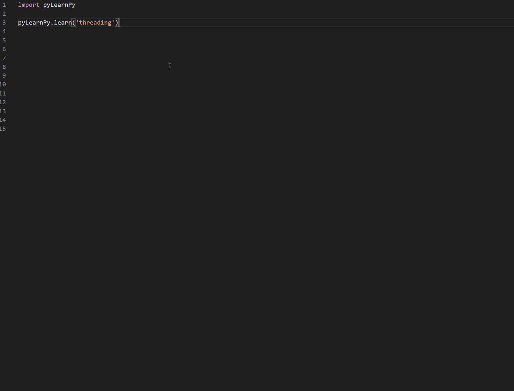

# pyLearnPy - Learn Python using Python BETA

Tired of remembering regex symbols and rules or the sytax to create multi threads in python, let pyLearnPy auto-type some boiler plate for you.

This is a beta version currently only tested for VS Code and windows machine and can be installed 

```
pip install -i https://test.pypi.org/simple/ pyLearnPy
```

## Features

